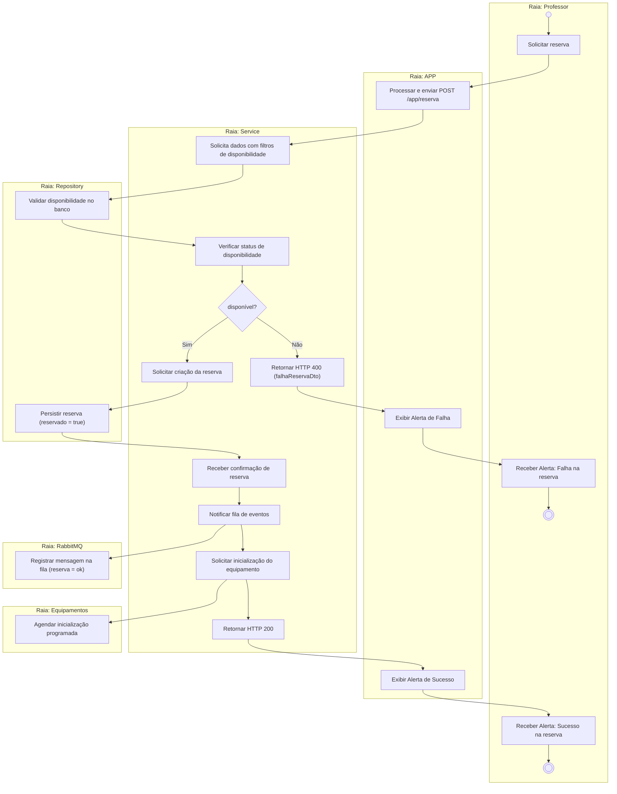

```mermaid
flowchart TD
    subgraph Professor["Raia: Professor"]
        inicio(( )) --> prof_solicitar["Solicitar reserva"]
        prof_sucesso["Receber Alerta: Sucesso na reserva"] --> fim1((( )))
        prof_falha["Receber Alerta: Falha na reserva"] --> fim2((( )))
    end

    subgraph APP["Raia: APP"]
        prof_solicitar --> app_post["Processar e enviar POST /app/reserva"]
        app_resp_200["Exibir Alerta de Sucesso"] --> prof_sucesso
        app_resp_400["Exibir Alerta de Falha"] --> prof_falha
    end

    subgraph Service["Raia: Service"]
        app_post --> service_validar["Solicita dados com filtros de disponibilidade"]
        service_recebe_status["Verificar status de disponibilidade"] --> decisao{"disponível?"}
        
        decisao -- Sim --> service_reservar["Solicitar criação da reserva"]
        service_confirma_reserva["Receber confirmação de reserva"] --> service_rabbitmq["Notificar fila de eventos"]
        service_rabbitmq --> service_equipamento["Solicitar inicialização do equipamento"]
        service_equipamento --> service_http200["Retornar HTTP 200"]
        
        decisao -- Não --> service_http400["Retornar HTTP 400 (falhaReservaDto)"]
    end

    subgraph Repository["Raia: Repository"]
        service_validar --> rep_check["Validar disponibilidade no banco"]
        rep_check --> service_recebe_status
        
        service_reservar --> rep_save["Persistir reserva (reservado = true)"]
        rep_save --> service_confirma_reserva
    end

    subgraph RabbitMQ["Raia: RabbitMQ"]
        service_rabbitmq --> rabbit_msg["Registrar mensagem na fila (reserva = ok)"]
    end

    subgraph Equipamentos["Raia: Equipamentos"]
        service_equipamento --> equip_agenda["Agendar inicialização programada"]
    end

    service_http200 --> app_resp_200
    service_http400 --> app_resp_400
```