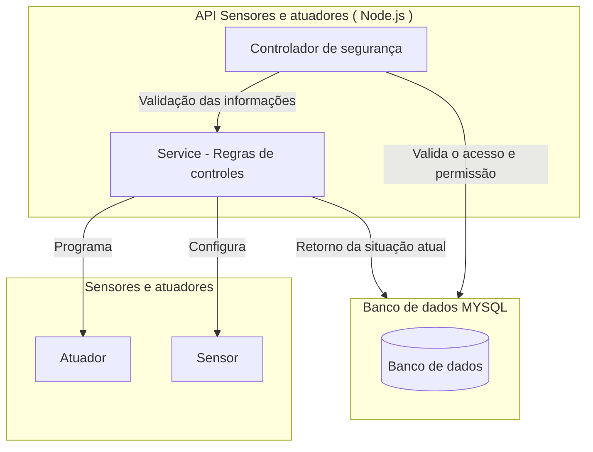

```mermaid
flowchart TD
    subgraph API["API Sensores e atuadores ( Node.js )"]
        ctrl["Controlador de segurança"]
        service["Service - Regras de controles"]
    end

    subgraph banco["Banco de dados MYSQL"]
        DB[("Banco de dados")]
    end 
 
    subgraph SA["Sensores e atuadores"]
        atuador["Atuador"]
        sensor["Sensor"]
    end

    ctrl -->|"Validação das informações"| service
    ctrl -->|"Valida o acesso e permissão"| banco
    service -->|"Retorno da situação atual"| banco
    service -->|"Programa"| atuador
    service -->|"Configura"| sensor
```