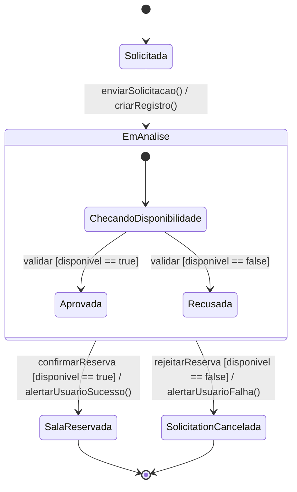

```mermaid
stateDiagram-v2
    [*] --> Solicitada

    state EmAnalise { 

        [*] --> ChecandoDisponibilidade
        ChecandoDisponibilidade --> Aprovada : validar [disponivel == true]
        ChecandoDisponibilidade --> Recusada : validar [disponivel == false]
    }

    Solicitada --> EmAnalise : enviarSolicitacao() / criarRegistro()

    EmAnalise --> SalaReservada : confirmarReserva [disponivel == true] / alertarUsuarioSucesso()
    EmAnalise --> SolicitationCancelada : rejeitarReserva [disponivel == false] / alertarUsuarioFalha()
    
    SalaReservada --> [*]
    SolicitationCancelada --> [*]
```