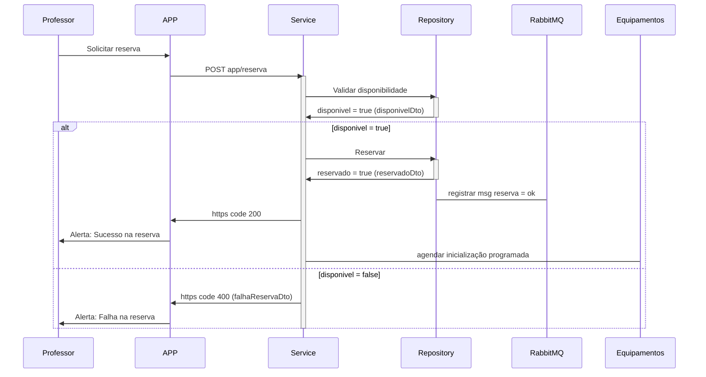

```mermaid
sequenceDiagram
    Professor->>APP: Solicitar reserva
    APP->>Service: POST app/reserva
    activate Service
    Service->>Repository: Validar disponibilidade
    activate Repository
    Repository->>Service: disponivel = true (disponivelDto)
    deactivate Repository 
    
    alt disponivel = true
        Service->>Repository: Reservar
        activate Repository
        Repository->>Service: reservado = true (reservadoDto)
        deactivate Repository
        Repository->RabbitMQ: registrar msg reserva = ok
        Service->>APP: https code 200
        APP->>Professor: Alerta: Sucesso na reserva
        Service->Equipamentos: agendar inicialização programada
    else disponivel = false
        Service->>APP: https code 400 (falhaReservaDto)
        APP->>Professor: Alerta: Falha na reserva
    end
    deactivate Service
```