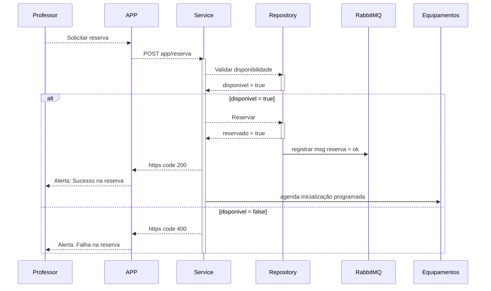

```mermaid
sequenceDiagram
    Professor-->>APP: Solicitar reserva
    APP-->>Service: POST app/reserva
    activate Service
    Service-->>Repository: Validar disponibilidade
    activate Repository
    Repository-->>Service: disponivel = true
    deactivate Repository 
    
    alt disponivel = true
        Service-->>Repository: Reservar
        activate Repository
        Repository-->>Service: reservado = true
        deactivate Repository
        Repository->>RabbitMQ: registrar msg reserva = ok
        Service-->>APP: https code 200
        APP-->>Professor: Alerta: Sucesso na reserva
        Service->>Equipamentos: agenda inicialização programada
    else disponivel = false
        Service-->>APP: https code 400
        APP-->>Professor: Alerta: Falha na reserva
    end
    deactivate Service
```